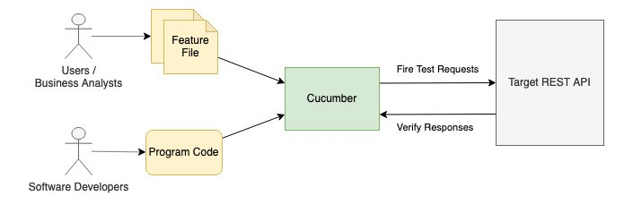

## Mock Test
## WireMock Test
When we need to do the integration test involving external libraries and apis, since we don't own them, it's not a good
idea to mock them. Instead we should consider to mock servers. If the libraries and the apis provide a mocking servers,
we can go ahead use them. If they don't offer it, we an use WireMock along with JUnit to mock the service calls.
`WireMock` is one of the most popular http mock servers, we can easily create stubs for customers and product service by
setting up mock responses. It can run as part of an application or a standalone process.
## Cucumber Behavior Driven Development
The concept of BDD is to build automated test cases based on system features which are written in the format of user
stories. The most development is done, the more number of test cases will be passed and eventually all test cases passed
upon completion of the development.
The key element is a feature file which is created by users and business analysts, it describes the system features in natural human language. 
Developers then build test logic in program code and map to each statement in the feature files to form automated test cases.
To execute test cases, we can make use of Cucumber, which is a popular testing framework for BDD, to bind feature files and program code together and run the test cases.

### Feature Definition
System requirements in the feature file are in a pattern of Given-When-Then. The pattern is based on the syntax called Gherkin, 
it defines the precondition in Given statement, action to be taken in When statement and the expected system behavior in Then statement.
Here is a simple example to specify the behavior of Google search feature. Such a format clearly describes system features in a natural human readable language.
```
Scenario: Search for BDD
Given A browser is opened at Google homepage
When I enter ‘BDD’ into the search bar and submit
Then Search result is shown with links related to ‘BDD’
```
If you would like to provide more sample data, then you can put them in the Examples section. 
Cucumber will then run the test case for every record line under the Examples section (except for the 1st header line). 
The example below will run the test case three times for each line in the Examples section.
```
Scenario Outline: Search for keywords
Given A browser is opened at Google homepage
When I enter ‘<keyword>’ into the search bar and submit
Then Search result is shown with links related to ‘<keyword>’
Examples:
| keyword     |
| BDD         |
| Cucumber    |
| Automation  |
```
The use of Given-When-Then pattern is beneficial to the development process as it keeps all user requirements in a consistent format and makes the requirements easy to understand.
Once the feature file is ready, developers can start building the technical implementation for each step in the requirement. 
For example, developers might write code to instruct Chrome browser to perform steps using Selenium according to Given and When clauses, 
then verify the search result as specified in Then clause.
## Spring Boot BDD Utilizing WireMock and Cucumber
1. add cucumber dependencies to `build.gradle.kts` file
```
testImplementation("io.cucumber:cucumber-java:7.3.4") // this might be an implementation
testImplementation("io.cucumber:cucumber-junit:7.3.4")
testImplementation("io.cucumber:cucumber-spring:7.3.4")
```
3. add WireMock dependencies to `build.gradle.kts` file
```
testImplementation("com.github.tomakehurst:wiremock-jre8:2.33.2")
```
## custom deserializer using Jackson 
create a Deserializer class extends jackson StdDesdrializer and override deserialize(JsonParser p,
DeserializationContext ctxt) method.
- To retrieve the root node, call `JsonNode jsonNode = p.getCodec().readTree(p)`
- To retrieve the node as an array, call `ArrayNode arrayNode = (ArrayNode)jsonNode.get("<nodeName>")`, then iterate the
  arrayNode
  

